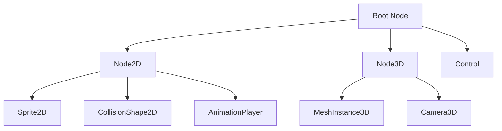

# 3. Mengenal Godot Engine: sejarah perkembangan dan keunggulannya dibanding engine lain

## Definisi Singkat
Godot Engine adalah game engine open-source yang dikembangkan oleh Juan Linietsky dan Ariel Manzur sejak tahun 2007. Godot memiliki keunggulan utama berupa lisensi MIT yang sangat fleksibel, ukuran editor yang ringan, dan sistem node yang unik untuk mengorganisasi game.

## Analogi
Godot seperti workshop kayu yang lengkap namun ringan dibawa. Berbeda dengan Unity atau Unreal yang seperti pabrik besar lengkap tapi membutuhkan banyak ruang dan biaya, Godot memberikan semua alat yang dibutuhkan dalam paket kecil tanpa biaya lisensi atau royalty.

## Struktur Node (Scene Tree)


## Kode GDScript (Godot 4)
```gdscript
extends Node2D

func _ready():
	print("Godot Engine Features:")
	print("1. Open-source dengan lisensi MIT")
	print("2. Editor ringan (~40MB)")
	print("3. Mendukung 2D dan 3D")
	print("4. Sistem scene unik (bukan ECS)")
	print("5. Cross-platform: Windows, macOS, Linux, Web, Mobile, Console")
	print("6. GDScript, C#, VisualScript, dan bahasa lain via GDExtension")
	
	var engine_version = Engine.get_version_info()
	print("Versi Godot: ", engine_version.major, ".", engine_version.minor)
```

## Kasus Penggunaan Nyata
Godot sangat cocok untuk indie developer, studio kecil, dan educational institutions karena tidak ada biaya lisensi atau royalty. Banyak game komersial sukses seperti "Dome Keeper" dan "Cassette Beasts" dibuat dengan Godot, membuktikan bahwa engine ini mampu menghasilkan game berkualitas tinggi.
