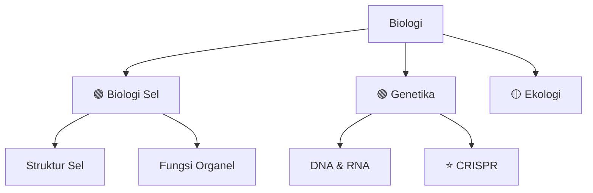

# PROMPT ENGINEERING UNTUK PERPUSTAKAAN DIGITAL 600+ BIDANG ILMU 🚀

Wah, sistem Anda sudah bagus! Saya akan tambahkan **prompt-prompt pelengkap** yang akan membuat perpustakaan digital Anda jauh lebih powerful, terutama untuk **bidang non-IT** dan **optimasi cross-reference**.

---

## 🎯 FASE 0: PROMPT PRE-ROADMAP (Context Setting)

Gunakan ini **SEBELUM** minta roadmap, agar AI tahu level dan tujuan Anda:

### **Prompt 0A: Profiling Bidang**

```
Saya ingin mempelajari bidang **[Nama Bidang]** untuk perpustakaan pengetahuan digital saya.

Sebelum membuat roadmap, tolong bantu saya pahami:

1. **Landscape**: Apa saja sub-bidang utama dalam **[Nama Bidang]**?
2. **Prerequisite**: Bidang ilmu apa yang sebaiknya saya pahami dulu sebelum belajar ini?
3. **Career Path**: Profesi apa saja yang membutuhkan keahlian di bidang ini?
4. **Depth Level**: Untuk level "paham" (bukan expert), sampai mana kedalaman yang diperlukan?
5. **Time Estimate**: Berapa lama estimasi waktu untuk mencapai level "paham" jika belajar 2 jam/hari?

Berikan dalam format tabel atau bullet point yang terstruktur.
```

**Kenapa penting?** → Anda jadi tahu "worth it atau tidak" untuk deep dive, dan berapa effort yang dibutuhkan.

---

### **Prompt 0B: Resource Mapping**

```
Untuk bidang **[Nama Bidang]**, rekomendasikan:

1. **3 Buku Terbaik**: (Pemula, Intermediate, Advanced)
2. **3 Course Online Gratis**: (YouTube, Coursera, edX, MIT OCW)
3. **5 Website/Blog Terpercaya**: Sumber informasi update
4. **3 Paper/Artikel Penting**: Yang wajib dibaca untuk memahami fondasi bidang ini
5. **Komunitas**: Forum/Discord/Reddit untuk diskusi
6. **Tools**: Software/aplikasi yang digunakan praktisi bidang ini

Format dalam tabel Markdown dengan kolom: Resource | Link/Nama | Level | Keterangan
```

**Benefit**: Anda punya "cheat sheet" sumber belajar terbaik untuk setiap bidang.

---

## 📚 FASE 1+: PROMPT ROADMAP (Enhanced Version)

### **Prompt 1A: Roadmap Terstruktur (Untuk Non-IT)**

```
Buatkan roadmap belajar untuk bidang **[Nama Bidang]** dengan struktur berikut:

## FASE FOUNDATIONAL (Bulan 1-2)
- List materi dasar yang WAJIB dikuasai
- Estimasi waktu per topik
- Output skill yang didapat

## FASE INTERMEDIATE (Bulan 3-4)
- Materi lanjutan yang membangun dari fondasi
- Koneksi antar konsep
- Output skill

## FASE ADVANCED (Bulan 5-6)
- Topik spesialisasi
- Aplikasi praktis
- Output skill

## FASE MASTERY (Opsional)
- Topik cutting-edge atau kontroversial
- Research area

**Format:**
Setiap topik diberi:
- [ ] Nomor. Nama Topik (Estimasi: X jam)
  - Sub-topik 1
  - Sub-topik 2
  - Deliverable: Apa yang harus bisa dilakukan setelah paham topik ini

Urutkan secara dependency graph (A harus dipelajari sebelum B).
```

---

### **Prompt 1B: Roadmap Visual (Untuk Mind Mapping)**

```
Buatkan roadmap **[Nama Bidang]** dalam format **Mermaid diagram** atau **ASCII tree** yang bisa saya paste ke Obsidian/Markdown.

Struktur:
1. Central node: Nama Bidang
2. Level 1 branches: Sub-bidang utama (3-5 cabang)
3. Level 2 branches: Topik-topik dalam setiap sub-bidang
4. Gunakan warna/emoji untuk menandai:
   - 🟢 Foundational (wajib)
   - 🟡 Intermediate
   - 🔴 Advanced
   - ⭐ Hot topic/trending

Berikan dalam format yang bisa langsung di-render di Obsidian Graph View.
```

**Contoh output yang diharapkan:**



---

## 🔬 FASE 2+: PROMPT PENJELASAN MATERI (Enhanced)

### **Prompt 2A: Penjelasan Materi Gaya Feynman**

```
Jelaskan materi **[Nomor & Nama Topik]** dari bidang **[Nama Bidang]** menggunakan Feynman Technique:

## 1️⃣ ELI5 (Explain Like I'm 5)
Jelaskan konsep ini seolah-olah saya anak 5 tahun yang belum tahu apa-apa.

## 2️⃣ Kehidupan Sehari-hari
Berikan 2 analogi berbeda:
- Satu dari kehidupan sehari-hari (non-teknis)

## 3️⃣ Konsep Inti (The Big Ideas)
Bullet point 5-7 poin paling penting. Setiap poin HARUS bisa berdiri sendiri.

## 4️⃣ Deep Dive
Penjelasan teknis lengkap dengan:
- Definisi formal
- Mekanisme/cara kerja
- Prinsip yang mendasari

## 5️⃣ Contoh Konkret
- **Jika sains**: Eksperimen/fenomena alam yang menunjukkan konsep ini
- **Jika sosial/humaniora**: Studi kasus/contoh sejarah
- **Jika formal**: Contoh soal + solusi step-by-step

## 6️⃣ Kesalahpahaman Umum
3 miskonsepsi yang sering terjadi tentang topik ini + klarifikasi yang benar.

## 7️⃣ Koneksi
Bagaimana topik ini berhubungan dengan:
- Topik lain dalam bidang yang sama
- Bidang ilmu lain (interdisipliner)
- Aplikasi di dunia nyata/industri

## 8️⃣ Meta-Learning
- **Kata kunci**: 5 istilah teknis untuk riset lebih lanjut
- **Pertanyaan lanjutan**: 3 pertanyaan mendalam untuk eksplorasi lebih jauh
- **Resources**: 1 paper/artikel + 1 video yang menjelaskan topik ini dengan baik

Format dalam Markdown dengan emoji untuk visual appeal.
```

---

### **Prompt 2B: Penjelasan Materi Gaya "First Principles"**

```
Jelaskan **[Topik]** dari bidang **[Nama Bidang]** menggunakan pendekatan First Principles:

## 🧱 Fundamental Axioms
Apa asumsi/aksioma paling dasar yang harus benar agar konsep ini valid?

## 🏗️ Build Up dari Nol
Bangun pemahaman step-by-step dari prinsip dasar:
1. Langkah 1 → Langkah 2 → Langkah 3 → ... → Konsep Lengkap

## 🔗 Dependency Tree
Topik apa yang HARUS dipahami sebelum bisa paham konsep ini?
Buat list dengan format:
- [ ] Prerequisite 1
- [ ] Prerequisite 2
  - [ ] Sub-prerequisite 2.1

## 🎯 Core Insight
Dalam 1 kalimat, apa "aha moment" terpenting dari topik ini?

## 🧪 Proof/Evidence
Bagaimana kita tahu konsep ini benar? (Eksperimen, bukti matematis, observasi)

## 🚫 Batasan
Kapan konsep ini TIDAK berlaku? Apa limitasinya?
```

---

### **Prompt 2C: Penjelasan untuk Bidang Humaniora/Sosial**

```
Jelaskan **[Topik]** dari bidang **[Nama Bidang]** dengan pendekatan multidimensional:

## 📖 Definisi & Sejarah
- Definisi konsensus saat ini
- Evolusi pemikiran tentang konsep ini sepanjang sejarah
- Tokoh-tokoh penting yang berkontribusi

## 🌍 Perspektif Berbeda
Bagaimana konsep ini dipandang dari sudut:
- **Perspektif A**: (misal: Marxist view)
- **Perspektif B**: (misal: Liberal view)
- **Perspektif C**: (misal: Postmodern view)

Bandingkan dan kontraskan.

## 📊 Studi Kasus / Contoh Historis
Berikan 2 contoh konkret dari sejarah atau peristiwa nyata yang mengilustrasikan konsep ini.

## 🗣️ Perdebatan & Kontroversi
Apa yang masih diperdebatkan tentang topik ini? Apa argumen pro dan kontra?

## 💡 Relevansi Kontemporer
Mengapa topik ini penting di dunia modern? Bagaimana aplikasinya dalam isu-isu saat ini?

## 🔍 Metodologi Penelitian
Bagaimana ilmuwan/peneliti di bidang ini mempelajari konsep ini? Metode apa yang digunakan?

## 📚 Bacaan Lanjutan
- 1 buku klasik (foundational text)
- 1 paper/artikel akademis
- 1 artikel populer/blog untuk perspektif accessible
```

---

### **Prompt 2D: Penjelasan untuk Bidang Sains Eksak**

```
Jelaskan **[Topik]** dari bidang **[Nama Bidang]** dengan pendekatan kuantitatif:

## 🔢 Definisi Matematis/Formal
Berikan definisi formal dengan notasi yang tepat.

## 📐 Derivasi/Pembuktian (jika applicable)
Tunjukkan bagaimana konsep ini diturunkan dari prinsip yang lebih fundamental.
(Tidak perlu sangat detail, tapi tunjukkan logical flow-nya)

## 🧮 Contoh Perhitungan
Berikan 1 contoh soal dengan solusi step-by-step:
- **Given**: ...
- **Find**: ...
- **Solution**:
  - Step 1: ...
  - Step 2: ...
  - **Answer**: ...

## 📊 Visualisasi
Deskripsi grafik/diagram yang membantu memahami konsep ini.
(Jika bisa, berikan dalam Mermaid diagram atau ASCII art)

## 🔬 Eksperimen
Eksperimen apa yang memvalidasi konsep ini? Bagaimana eksperimen tersebut dirancang?

## ⚙️ Aplikasi Praktis
Dimana konsep ini digunakan di dunia nyata? (Engineering, teknologi, industri)

## 🧩 Koneksi Matematis
Bagaimana konsep ini berhubungan dengan area matematika lain?

## 💻 Implementasi Komputasi
(Jika applicable) Berikan pseudocode atau algoritma untuk mensimulasikan konsep ini.
```

---

## 🔄 FASE 3: PROMPT KONSOLIDASI & REVIEW

### **Prompt 3A: Mind Map Generator**

```
Dari semua materi yang sudah saya pelajari di bidang **[Nama Bidang]**, buatkan:

1. **Concept Map** dalam format Markdown/Mermaid yang menunjukkan:
   - Central concept
   - 5-7 konsep utama
   - Hubungan antar konsep (gunakan arrow dengan label)

2. **Analogi Besar**: Jika keseluruhan bidang ini adalah sebuah sistem (misal: kota, ekosistem, komputer), apa peran setiap konsep utama dalam sistem tersebut?

3. **Dependency Graph**: Urutan optimal mempelajari topik-topik ini jika mulai dari nol.

Format agar bisa langsung di-paste ke Obsidian untuk visualisasi.
```

---

### **Prompt 3B: Flashcard Generator (Active Recall)**

```
Buatkan 20 flashcard untuk bidang **[Nama Bidang]** dalam format:

**DEPAN (Pertanyaan):**
[Pertanyaan yang memicu recall aktif]

**BELAKANG (Jawaban):**
[Jawaban ringkas + 1 kalimat context]

---

**Distribusi:**
- 5 kartu: Definisi konsep kunci
- 5 kartu: Hubungan antar konsep
- 5 kartu: Aplikasi praktis
- 5 kartu: Kesalahpahaman umum

Format dalam tabel Markdown:
| No | Pertanyaan | Jawaban |
|----|-----------|---------|

Agar bisa langsung saya import ke Anki atau review manual.
```

---

### **Prompt 3C: Test Your Understanding**

```
Buatkan ujian komprehensif untuk bidang **[Nama Bidang]** dengan:

## Part A: Multiple Choice (10 soal)
- 5 soal level recall (ingat definisi/fakta)
- 5 soal level aplikasi (gunakan konsep dalam situasi baru)

## Part B: Short Answer (5 soal)
- Soal yang mengharuskan saya menjelaskan konsep dengan kata sendiri

## Part C: Problem Solving (3 soal)
- Soal yang mengharuskan saya mengaplikasikan multiple konsep untuk memecahkan masalah kompleks

## Part D: Critical Thinking (2 soal)
- Soal esai yang meminta saya mengevaluasi/menganalisis/membandingkan

**Jangan berikan jawaban dulu.** Setelah saya jawab, baru berikan kunci jawaban + penjelasan.

Format setiap soal dengan jelas (nomor, poin, instruksi).
```

---

## 🌉 FASE 4: PROMPT CROSS-REFERENCE (Interdisciplinary)

### **Prompt 4A: Bridge Builder**

```
Saya sudah mempelajari bidang **[Bidang A]** dan **[Bidang B]**.

Tolong jelaskan:

1. **Overlap**: Konsep apa yang muncul di kedua bidang ini? Bagaimana perspektif berbeda di masing-masing bidang?

2. **Complementary**: Bagaimana kedua bidang ini saling melengkapi? Berikan 3 contoh masalah yang perlu kedua bidang untuk diselesaikan.

3. **Contradictions**: Adakah konsep yang bertentangan antara kedua bidang? Bagaimana paradoks ini dijelaskan?

4. **Synergy**: Jika saya menggabungkan knowledge dari kedua bidang ini, insight baru apa yang bisa saya dapat?

5. **Real-world Application**: Profesi atau proyek apa yang membutuhkan expertise di kedua bidang ini?

Format dalam tabel perbandingan dimana applicable.
```

---

### **Prompt 4B: Interdisciplinary Project Idea**

```
Berdasarkan pengetahuan saya di bidang:
- [Bidang 1]
- [Bidang 2]
- [Bidang 3]

Buatkan 5 ide proyek interdisipliner yang:
1. Menggunakan konsep dari minimal 2 bidang di atas
2. Solve masalah real-world
3. Bisa saya eksekusi dalam 1-3 bulan
4. Menambah portfolio saya

Untuk setiap ide, berikan:
- **Judul Proyek**
- **Deskripsi 1 paragraf**
- **Bidang yang diintegrasikan**
- **Output/Deliverable**
- **Skills yang diasah**
- **Estimasi waktu & effort**
```

---

## ⚡ FASE 5: PROMPT MAINTENANCE & UPDATE

### **Prompt 5A: Update Checker**

```
Bidang **[Nama Bidang]** terakhir saya pelajari di **[Bulan/Tahun]**.

Apa saja perkembangan terbaru (breakthrough, paradigm shift, teknologi baru) yang terjadi di bidang ini sejak saat itu?

Berikan:
1. **Timeline**: Perkembangan penting dengan tanggal
2. **Implikasi**: Apa yang berubah dalam pemahaman fundamental?
3. **Updated Roadmap**: Topik baru apa yang perlu saya tambahkan ke roadmap saya?
4. **Deprecated Knowledge**: Apa yang sudah outdated dan tidak perlu saya pelajari lagi?

Format: Timeline dengan bullet points + ringkasan impact.
```

---

### **Prompt 5B: Knowledge Gap Identifier**

```
Saya sudah mempelajari topik-topik berikut di bidang **[Nama Bidang]**:
- [List topik yang sudah dipelajari]

Identifikasi:
1. **Missing Pieces**: Topik penting apa yang belum saya pelajari untuk mencapai "comprehensive understanding"?
2. **Weak Links**: Topik apa yang pemahaman saya mungkin masih superficial (tanda: saya hanya hafal definisi tapi tidak bisa aplikasikan)?
3. **Quick Wins**: Topik mana yang paling efisien untuk saya pelajari berikutnya (high impact, low effort)?

Buat priority matrix:
| Topik | Importance | Current Mastery | Effort Needed | Priority |
|-------|-----------|-----------------|---------------|----------|

Priority: Critical / High / Medium / Low
```

---

## 🎨 PROMPT BONUS: NON-IT SPECIFIC

### **Prompt B1: Historical Context (Untuk Humaniora/Sosial)**

```
Untuk bidang **[Nama Bidang]**, buatkan timeline sejarah perkembangan:

## Ancient Era (Pre-1500)
- Pemikir/peradaban awal yang berkontribusi
- Ide-ide foundational

## Modern Era (1500-1900)
- Tokoh-tokoh kunci
- Teori/paradigma yang muncul

## Contemporary Era (1900-sekarang)
- Revolusi pemikiran
- Perdebatan aktif
- State of the art saat ini

Untuk setiap era, highlight:
- 3 tokoh paling berpengaruh
- 1-2 ide paling revolusioner
- 1 quote terkenal

Format: Timeline visual (bisa ASCII atau Mermaid).
```

---

### **Prompt B2: Ethnographic Lens (Untuk Sosial/Budaya)**

```
Jelaskan bagaimana konsep **[Topik]** dari bidang **[Nama Bidang]** dipahami dan dipraktikkan di 3 budaya berbeda:

1. **Budaya Barat** (Eropa/Amerika)
2. **Budaya Timur** (Asia)
3. **Budaya [Pilih]: Afrika/Amerika Latin/Indigenous**

Untuk setiap budaya:
- **Perspektif**: Bagaimana konsep ini dipahami?
- **Praktik**: Bagaimana ini diterapkan dalam kehidupan sehari-hari?
- **Nilai**: Nilai budaya apa yang shape pemahaman mereka?

Bandingkan dan kontraskan dalam tabel komparatif.
```

---

### **Prompt B3: Philosophical Deep Dive**

```
Untuk konsep **[Topik]** dalam bidang **[Nama Bidang]**, eksplorasi dimensi filosofis:

## Ontologi (Being)
Apa hakikat keberadaan konsep ini? Apakah ini real atau konstruksi sosial?

## Epistemologi (Knowledge)
Bagaimana kita tahu tentang konsep ini? Apa yang bisa dan tidak bisa kita ketahui?

## Ethics (Moral)
Implikasi moral apa yang timbul dari konsep ini?

## Metaphysics
Pertanyaan fundamental apa yang diajukan konsep ini tentang realitas?

## Contemporary Debates
Apa perdebatan filosofis yang masih ongoing?

Berikan argumen dari minimal 2 aliran filsafat yang berbeda.
```

---

## 📦 TEMPLATE PROMPT MODULAR (Mix & Match)

Anda bisa kombinasikan elemen-elemen ini sesuai kebutuhan:

### **[MODULE: OUTPUT FORMAT]**
Pilih salah satu:
- `Format dalam Markdown dengan heading H2 untuk section utama`
- `Format dalam tabel dengan kolom: X, Y, Z`
- `Format dalam Mermaid diagram`
- `Format dalam bullet points bertingkat`
- `Format dalam Q&A style`

### **[MODULE: DEPTH LEVEL]**
Pilih salah satu:
- `Jelaskan untuk pemula total (ELI5)`
- `Jelaskan untuk orang yang sudah tahu dasar-dasarnya (intermediate)`
- `Jelaskan dengan asumsi saya sudah paham prerequisite (advanced)`
- `Jelaskan sedetail paper akademis`

### **[MODULE: PERSPECTIVE]**
Pilih salah satu:
- `Dari perspektif praktisi/profesional`
- `Dari perspektif akademis/teoretis`
- `Dari perspektif historical evolution`
- `Dari perspektif interdisipliner`

### **[MODULE: COGNITIVE STYLE]**
Pilih salah satu:
- `Gunakan visual thinking (banyak diagram/analogi)`
- `Gunakan logical/sequential thinking (step-by-step)`
- `Gunakan pattern recognition (compare & contrast)`
- `Gunakan storytelling (narrative format)`

---

## 🚀 WORKFLOW RECOMMENDATION

Untuk memaksimalkan efisiensi Anda dalam membangun 600+ bidang:

### **Tier 1 Bidang (High Priority - IT Core & Adjacent)**
Gunakan workflow lengkap:
1. Prompt 0A + 0B (Context + Resources)
2. Prompt 1A atau 1B (Roadmap terstruktur)
3. Prompt 2A atau 2D (Penjelasan mendalam per materi)
4. Prompt 3A + 3B (Konsolidasi + Flashcard)
5. Prompt 3C (Test understanding)

### **Tier 2 Bidang (Medium Priority - Interdisciplinary)**
Workflow medium:
1. Prompt 0A (Quick overview)
2. Prompt 1A (Roadmap)
3. Prompt 2A (Penjelasan Feynman untuk topik kunci saja)
4. Prompt 3A (Mind map)

### **Tier 3 Bidang (Low Priority - General Knowledge)**
Workflow cepat:
1. Prompt 3 dari prompt asli Anda (Executive Summary)
2. Prompt 3B (Flashcard untuk top 10 konsep)

---

## 💾 BONUS: METADATA PROMPT (Untuk Obsidian)

```
Untuk setiap artikel yang saya buat tentang **[Topik]** dalam bidang **[Nama Bidang]**, buatkan YAML frontmatter untuk Obsidian:

---
title: "[Nama Topik]"
aliases: [sinonim1, sinonim2]
tags: 
  - [nama-bidang]
  - [sub-kategori]
  - [level-kesulitan]
date_created: [YYYY-MM-DD]
date_modified: [YYYY-MM-DD]
status: [seed/budding/evergreen]
related_topics:
  - [[topik-terkait-1]]
  - [[topik-terkait-2]]
prerequisites:
  - [[prerequisite-1]]
leads_to:
  - [[topik-lanjutan-1]]
sources:
  - [sumber-1]
confidence: [1-5 rating pemahaman saya]
---

Berikan rekomendasi tags yang konsisten dengan taxonomy perpustakaan digital saya.
```

---

## ✅ CHECKLIST KUALITAS OUTPUT

Setelah AI generate, pastikan output punya elemen ini:

**Untuk Roadmap:**
- [ ] Urutan topik logis (dependency-aware)
- [ ] Estimasi waktu jelas
- [ ] Clear learning objectives per topik
- [ ] Ada marking untuk prerequisite

**Untuk Penjelasan Materi:**
- [ ] Ada ELI5/analogi
- [ ] Ada contoh konkret
- [ ] Ada koneksi dengan topik lain
- [ ] Ada kata kunci untuk riset lanjutan
- [ ] Format Markdown rapi (bisa langsung copas)

**Untuk Flashcard:**
- [ ] Pertanyaan jelas dan spesifik
- [ ] Jawaban ringkas tapi cukup
- [ ] Ada mix antara recall dan aplikasi

---

Apakah ada jenis prompt spesifik lain yang Anda butuhkan? Atau ada bidang tertentu yang mau kita bikin "custom prompt template" nya? 🎯